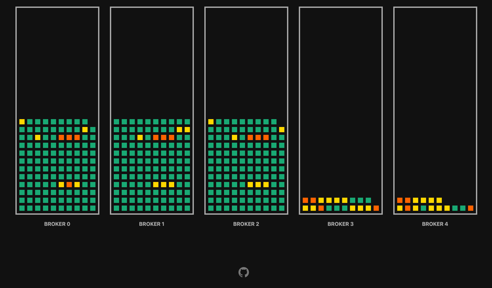

# Kafka Topic View

Kafka Topic View is a simple UI for monitoring Kafka topics and their state.
It lists all Kafka brokers, and the partitions assigned to them.
The partitions are listed as squares with colors from green (the partitions is in good shape) to red (the partition is under-replicated or offline).
When you hover over the partition square, a tooltip shows the details of the partition. 



## TODO

* Configure refresh interval in the UI
* Add SASL support
* Better logging
* CI build

## Usage

### Locally

Run the binary and use the configuration options to configure where it listens and how it connects to Kafka:

Option | Description | Default
------------ | ------------- | ------------- 
`--listen-addr` | The address where the HTTP Server runs | `0.0.0.0:8080`
`--fetch-interval` | The interval at which to fetch the new topic data (default 1m0s) | `1m0s`
`--bootstrap-server` | Comma separate list of Kafka Brokers to connect to | 
`--kafka-version` | Version of the Kafka cluster | `2.5.0`
`--tls-ca-file` | File with the CA certificate for server authentication | 
`--tls-cert-file` | File with the client certificate for client authentication | 
`--tls-insecure-skip-verify` | Skip TLS verification when connecting to the Kafka brokers. Use at your own risk! | 
`--tls-key-file` | File with the key for client authentication | 
`--verbose` | Turn on verbose logging | `false`
`--sarama-verbose` | Turn on verbose logging int he Sarama Kafka client | `false`

### In Kubernetes with Strimzi

Edit the [`deployment-strimzi.yaml` file](./deployment-strimzi.yaml) to match your Strimzi cluster setup (secret names, cluster name, bootstrap servers etc.) and deploy it to Kubernetes:

```
kubectl apply -f deployment-strimzi.yaml
```

Use `kubectl proxy` or `kubectl port-forward` to access the UI.

## Build

Build the Golang backend first:

```
go build
```

If needed, build also the container with the backend and UI:

```
docker build -t <org>/<image>:<tag> ./
```
 